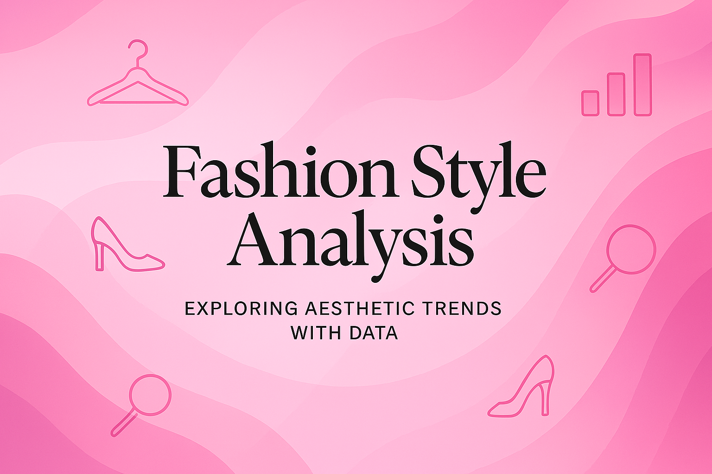
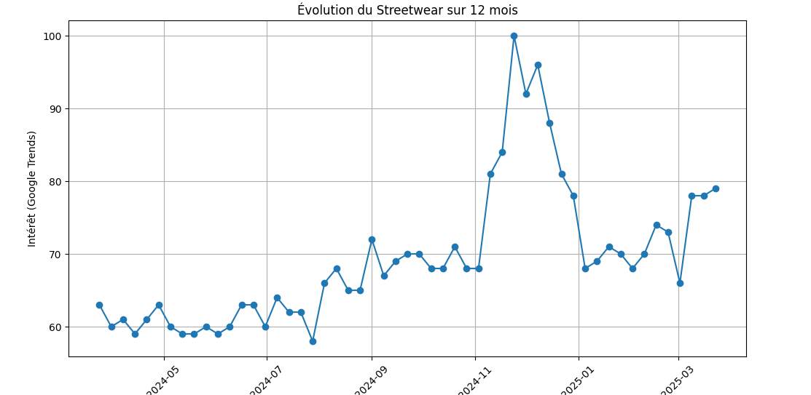
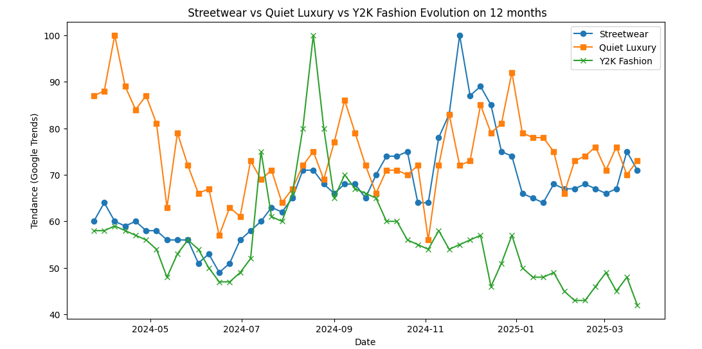
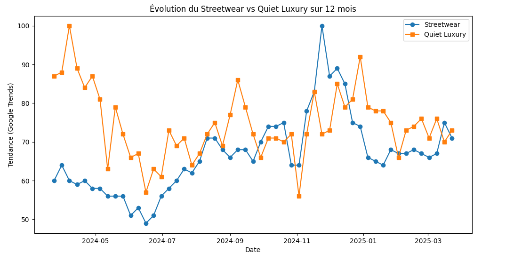

<p align="center">
  
</p>

# 👗 Fashion Style Analysis

**Exploring the rise and fall of fashion aesthetics through Google Trends data.**  
This project focuses on the popularity of Streetwear, Quiet Luxury, and Y2K styles across the past 12 months.

---

## 📊 Visuals & Trend Exploration

### 🔹 Streetwear Trend Evolution (2024–2025)


The streetwear aesthetic shows consistent interest over the year, with a major spike around November 2024 — potentially driven by fashion drops, celebrity influence or seasonal hype.

---

### 🔹 Streetwear vs Quiet Luxury vs Y2K (2024–2025)


This comparison reveals how the resurgence of Y2K had a moment of peak in late summer, while Quiet Luxury dominated early 2024. Streetwear remained more stable over time.

---

### 🔹 Streetwear vs Quiet Luxury Focus


We observe that both aesthetics competed closely in Q4 2024. However, Streetwear took over in popularity in late fall — showing its resilience and cultural longevity.

---

## 📈 Insights Summary

- **Streetwear** remains a dominant, stable force with peaks in colder seasons.
- **Quiet Luxury** appeals to high-season sophistication (Q1–Q2).
- **Y2K Fashion** hits temporary highs but lacks long-term consistency.

---

## 🛠 Tools & Technologies

- Python
- Pandas
- Matplotlib
- Google Trends
- Jupyter Notebook

---

## 📁 Project Structure

```bash
fashion-style-analysis/
├── data/
├── visuals/
│   ├── banner.png
│   ├── streetwear.png
│   ├── streetwear_quiet_luxury_y2k.png
│   └── streetwear_vs_quiet_luxury.png
├── notebooks/
│   └── style_analysis_analysis.ipynb
├── README.md
└── LICENSE
```

---

## 👩🏽‍💻 About Me

Fashion & tech enthusiast, exploring data aesthetics and the psychology behind fashion trends.  
Let’s bridge culture and code 👠🧠

📌 Portfolio soon on Behance | LinkedIn | GitHub

---

## 📜 License

MIT License – Free to use, modify and share.
